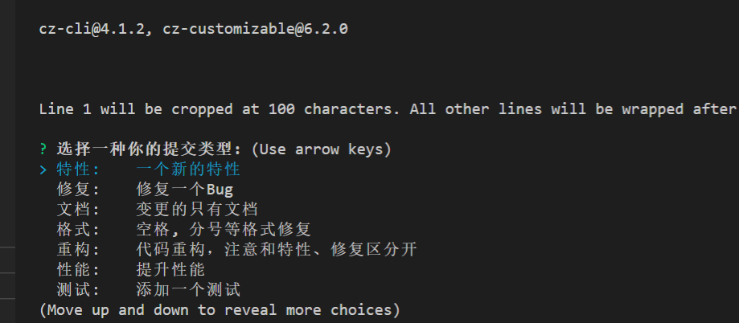

### git commit 规范说明
为了规范git commit 提交记录 项目引入conventional及相关依赖。为规范git commit 提交的记录  
可参考 [Commit message 和 Change log 编写指南](http://www.ruanyifeng.com/blog/2016/01/commit_message_change_log.html) - 阮一峰的网络日志  
项目引用的是angular规范 提交规范如下所示：
```
<type>(<scope>): <subject>  // header 必填 
// 空一行
<body>                      // body  可选
// 空一行
<footer>                    // footer 可选
```
Header部分只有一行包括三个字段：type（必需）、scope（可选）和subject（必需）  
>type说明commit的类型，即用于区分本次提交内容的类型，类型大致有：
  >+ feat：新功能（feature）
  >+ fix：修补bug
  >+ docs：文档（documentation）
  >+ style： 格式（不影响代码运行的变动）
  >+ refactor：重构（即不是新增功能，也不是修改bug的代码变动）
  >+ perf: 提升性能
  >+ test：增加测试
  >+ chore：构建过程或辅助工具的变动
  >+ revert: 代码回退或者这次提交为撤销之前某次提交，下面是特别说明   

>revert：如果当前 commit 用于撤销以前的 commit，则必须以revert:开头，后面跟着被撤销 Commit 的 Header。Body部分的格式是固定的，必须写成This reverts commit &lt;hash>.，其中的hash是被撤销 commit 的 SHA 标识符。 例：
```
revert: feat(pencil): add 'graphiteWidth' option  

This reverts commit 667ecc1654a317a13331b17617d973392f415f02. 
```
  
>scope用于说明 commit 影响的范围，比如数据层、控制层、视图层等等，视项目不同而不同。  

>subject是 commit 目的的简短描述，可以理解为标题  

Body 部分是对本次 commit 的详细描述，可以分成多行。  

Footer 部分只用于两种情况。
> + 不兼容变动
> + 关闭 Issue
 
### git commit 校验
为了规范git commit 提交记录 加入了validate-commit-msg 强制校验，配合ghooks 在git commit 钩子上做了 commit 提交记录校验，如果不符合angular规范则无法提交commit  

### git cz 
本项目由git cz 用于替换 git commit 为了保证commit 提交的记录符合angular规范 例:

为方便使用特意做了汉化 根据提示，填写即可



### changelog 
执行以下命令自动生成 日志，日志将根据git commit 所提交的内容生成 
```
npm run log
```
日志生成将依赖于git所打的标签来划分阶段，即 git tag  
日志生成的版本号是依赖于package.json 的version